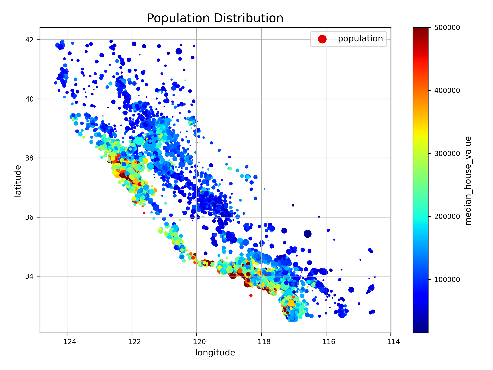
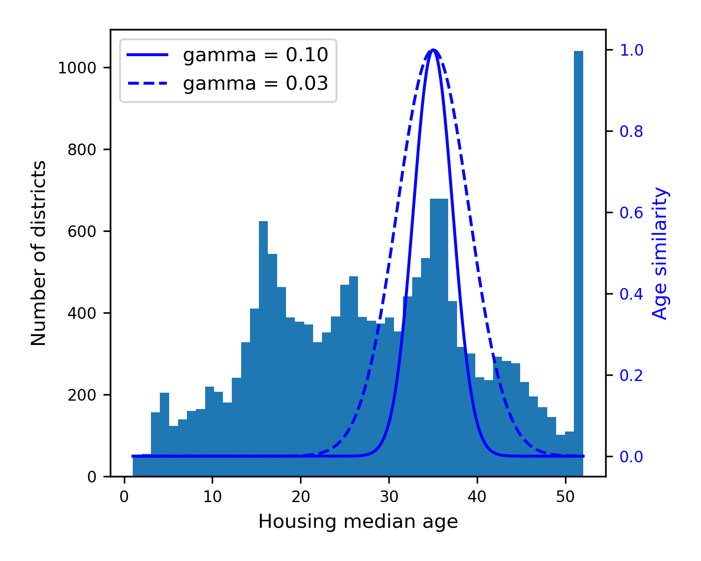
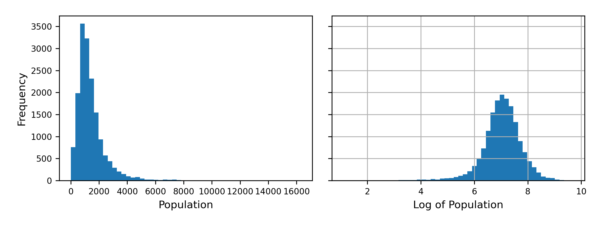
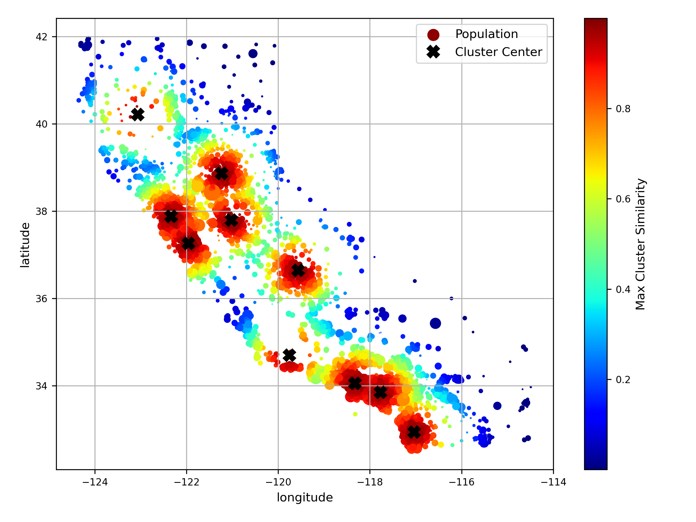
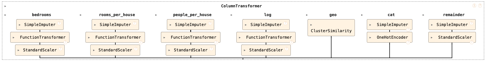
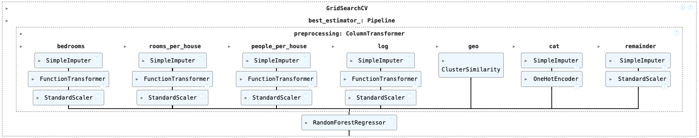
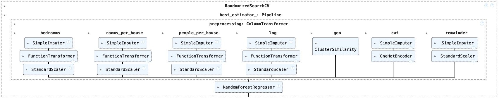

# California Housing Prediction with Sklearn Pipeline

## Overview

This project demonstrates a structured approach to data preprocessing, feature engineering, and model selection. The goal is to showcase key techniques in **exploratory data analysis (EDA), data transformation, and model fine-tuning**. The entire process is streamlined using **pipelines**, ensuring reproducibility and scalability.

## 📊 Data Exploration & Transformation

A thorough **exploratory data analysis (EDA)** was performed to understand data distributions, relationships, and potential feature transformations. Key techniques used:

- Examined attribute distributions using **histograms**.
- Used **correlation matrices** to identify the most correlated features.
- Created **attribute combinations** that improved correlation with the target variable.
- Visualized **longitude and latitude** data through **scatter plots**.
- Applied **stratified sampling** based on `median_income`, the most correlated factor.
- Examined **geographical latitude and longitude** patterns with clustering.
- Visualized **RBF kernel similarity effects** on the transformed feature space.

   
   
 

## 🛠️ Data Transformation Pipeline

To ensure consistency across training and testing datasets, a **Scikit-Learn Pipeline** was implemented. The pipeline integrates:

- **Feature Engineering & Attribute Combination:**

  - Created new ratio-based attributes:
    - `bedrooms_per_room = total_bedrooms / total_rooms`
    - `rooms_per_house = total_rooms / households`
    - `people_per_house = population / households`

- **Handling Features with Heavy Tail:**

  - Applied **log transformation** to features such as `total_bedrooms`, `total_rooms`, `population`, `households`, and `median_income`.

  

    
  

- **🌍 Geographical Feature Transformation:**
  - Used **KMeans clustering** to assign spatial clusters based on latitude and longitude.
  - Applied **RBF kernel transformation** to measure similarity to cluster centers.

    
  

- **🔢 Categorical Feature Encoding:**

  - Used `OneHotEncoder` to handle categorical features after imputing missing values with the most frequent category.

- **💪 Numerical Feature Scaling & Handling Missing Values:**

  - Used `SimpleImputer` for missing values.
  - Applied `StandardScaler` for feature scaling.

- **Used Sklearn Pipeline to Streamling the Preprocessing**

  

This approach eliminates data leakage risks and allows seamless integration of preprocessing steps into the machine learning workflow.

## 📈 Model Experimentation & Fine-Tuning

Multiple models were tested to identify the best-performing one. The following steps were taken:

- **Baseline Model Testing:**

  - Experimented with **Linear Regression, Decision Tree, and Random Forest** models.

- **Hyperparameter Tuning:**

  - Applied **Grid Search** and **Randomized Search** to optimize model parameters on `Random Forest`.
  - Evaluated model performance using cross-validation.

  

    
     
  

- **Final Model Selection:**
  - Chose the most promising model based on accuracy metric
  - Conducted error analysis and feature importance studies.

This project serves as a demonstration of **data transformation, model selection, and systematic experimentation** in machine learning. 🚀
